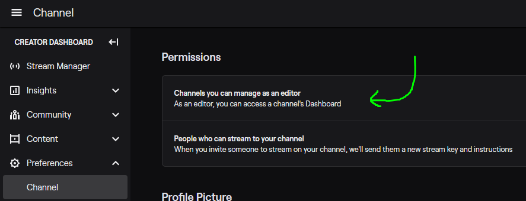
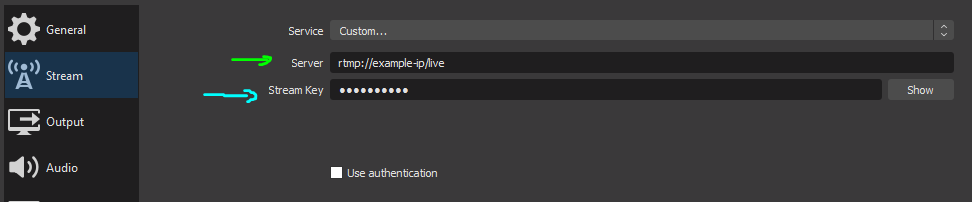

# Sneakbike

- [Quickstart](#quickstart)
  - [Step 0: Backing Everything Up For Safety](#step-0--backing-everything-up-for-safety)
  - [Step 1: Necessary Software](#step-1--necessary-software)
  - [Step 2: Download this Repository](#step-2--download-this-repository)
  - [Step 3. Import things](#step-3-import-things)
    - [Importing a Profile](#importing-a-profile)
    - [Importing Scenes](#importing-scenes)
  - [Step 4. The Final Touches](#step-4-the-final-touches)
- [Dev / Backend Users](#dev---backend-users)
- [Common Issues and Solutions](#common-issues-and-solutions)
  - [OBS](#obs)
  - [Retroarch](#retroarch)

## Quickstart

This guide will get you started in setting up your OBS + Computer for the Sneakbike Mystery Races. This looks like a lot, but it's really just a bunch of very easy steps. Get goin'!

---

### Step 0: Backing Everything Up For Safety

If you've already been using OBS, it's better to be safe than sorry. We'll back up your major things:


1. Go to `Profile > Export`. Save your profile in a safe place. It wants you to pick a folder, just pick whatever you want and it'll make its own folder inside of it.

   

   - You can re-import your profile if something goes wrong.
   - Don't worry, this hasn't happened to me yet.


2. Go to `Scene Collection > Export`. Save your scene collection in a safe place.

   
   - You can re-import your scenes if something goes wrong.
   - Don't worry, this hasn't happened to me yet either.

---

### Step 1: Necessary Software

For a consistent experience, we use the following:

1. A recent version of `Retroarch` (currently v1.8.8)

   - [Windows Download](http://buildbot.libretro.com/stable/1.8.8/windows/x86_64/RetroArch-x64-setup.exe)
   - **TODO: Mac**
   - **TODO: Linux**

2. The following `Retroarch cores` by opening Retroarch and clicking `Load Core > Download Core` and picking the following:

   - Nintendo - Game Boy / Color (Gambatte)
   - Nintendo - Game Boy Advance (mGBA)
   - Nintendo - NES / Famicom (Masen)
   - Nintendo - SNES / SFC (Snes9x)
   - Sega MS/GG/MD/CD (Genesis Plus GX)

3. Fairly recent version of `OBS` (currently 25.0.8)
   - [Windows Download](https://cdn-fastly.obsproject.com/downloads/OBS-Studio-25.0.8-Full-Installer-x64.exe)
   - **TODO: Mac**
   - **TODO: Linux**

---

### Step 2: Download this Repository

1. Go to "Clone or Download" on this webpage and download the zip file of this repository. Unzip it when it's done downloading.

      

---

### Step 3. Import things

There are two things we need to import, Scenes and a Profile.

#### Importing a Profile

1. In OBS, go to `Profile > Import`, click the `Sneakbike_Profile` folder from the unzipped repository.

   

2. If you click `Profile` again, you should see (probably) two profiles at the bottom: `Untitled` and `Sneakbike`. `Untitled` is your default. You can switch back to `Untitled` to go back to your normal streaming profile.

#### Importing Scenes

1. In OBS, go to `Scene Collection > Import`, click the `...` button and find the `snakebike_scenes.json` file in the unzipped folder.

   

2. Click `Import`.
3. If you go into `Scene Collection` again, you should see (probably) two scenes at the bottom: `Untitled` and `Sneakbike`. `Untitled` is your default scenes. You can switch back to `Untitled` to get back to your default scenes.
   - Try switching between the two and you'll get the gist of what's happening.

**We'll be using the `Sneakbike` profile with the `Sneakbike` scenes for these races.**

---

### Step 4. The Final Touches

0. Before beginning the races, please try out some games from NES, SNES, Genesis to make sure your controller is correctly configured.
   - Most Genesis games do not require the full Genesis controller and we will try to avoid the ones which do.
   - We will give a list of games to try out in the `#Sneakbike` channel.

**At Race time:**

1. When we're beginning the race, we'll give out an address that you'll need to stream to. For example, it may look like: `rtmp://127.0.0.1:1935/live` and we will give you a password like `super_duper_secret`.  
2. In OBS, do the following:
   - Go into `File > Settings > Stream`,
   - Select `Service: Custom...`
   - The `Server:` field is where you paste the address from step 1. 
   - The `Stream Key` is the password we give you.
  
      

3. At this point, you should be able to start stream using "Start Streaming" in the OBS program.

**Note**:

- You will **NOT be streaming to Twitch when you hit "Start Streaming"** but rather your stream will go through our RTMP server which will collect everyone's stream and redirect it so we can have multiple people on a single stream.
- Your twitch "on-air" alerts or emails will not go out, as you're not actually streaming to twitch.

**Awesome, now you're ready to race!**

---

---

## Dev / Backend Users

Included is a shell file (`server_setup.sh`) which can be used as the startup script on an Ubuntu 18.04 EC2 instance (or cloud equivalent). The tl;dr is that it installs nginx and an rtmp add-on for nginx.

Note the nginx config at the bottom: here we have four different ports open that users can use. The addresses will look like this:

```bash
rtmp://public-ip-address-of-ec2:port/live/secret_key
```

Here, the ports go from 1935 (standard RTMP port) to 1938. The secret key doesn't matter and you can give it to your users in private for safety.

To pull the streams from the RTMP server you can use VLC or the VLC plugin on OBS: point it to the `rtmp` address above and it should pick up your user correctly.

---

---

## Common Issues and Solutions

This will be updated as we find more issues and more solutions.

### OBS

| Issue       | Solution |
| ----------- | -------- |
| SLOBS doesn't work! | Unfortunately, SLOBS does not support multiple profiles at this point, making standardization a bit wonky.  We require OBS for Sneakbike, though you can download OBS side-by-side with SLOBS and there should be no real conflict.         |

---

### Retroarch

| Issue                                | Solution                 |
| ------------------------------------ | ------------------------ |
| Controller doesn't work in Retroarch | **TODO: find solution.** |

---

---
