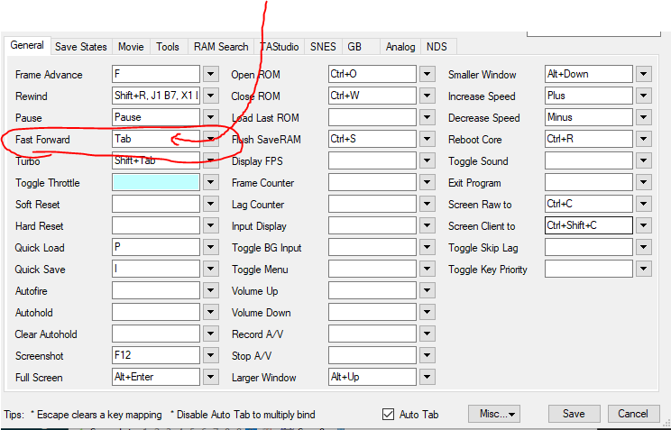

# Runner Resources

- [Runner Resources](#runner-resources)
  - [Beginning the Race](#beginning-the-race)
  - [My Game is Too Loud!](#my-game-is-too-loud-)

---

---

## Beginning the Race

1. When we're beginning the race, we'll give out an address and password.
   - For example, the address may look like: `rtmp://127.0.0.1:1935/live` and the password like `super_duper_secret`.
2. In OBS, do the following:

   - Go into `File > Settings > Stream`,
   - Select `Service: Custom...`
   - The `Server:` field is where you paste the address from step 1.
   - The `Stream Key` is the password we give you.

   

3. At this point, you should be able to start stream using "Start Streaming" in the OBS program. We'll most likely let you know if everything is working correctly.

**Note**:

- You will **NOT be streaming to Twitch when you hit "Start Streaming"** but rather your stream will go through our RTMP server which will collect everyone's stream and redirect it so we can have multiple people on a single stream.
- Your twitch "on-air" alerts or emails will not go out, as you're not actually streaming to twitch.

---

---

## Emulator Setup

For each emulator there are a few nice things to set up.

### Bizhawk

For Bizhawk, to set up the controller for each system, you'll need to open a ROM for that system. For example, open up Zelda: ALttP for the SNES and that will allow you to configure your controller for SNES.

- **IMPORTANT: Disable Start Button for Fast-Forward**: `Config > Configure Hotkeys > Click the box next to "Fast Forward" and hit the Tab keyboard key`.

  - This should change the box to say "Tab", as in the image below.
  - This is important since otherwise the start button will ALSO fast-forward your game.

  

* **Adjust Volume**: `Config > Sound > Adjust on the left-hand-size`.
* **Controller Setup**:
  - Open a ROM for that system (any game should work) then go to `Config > Controllers`.
  - You should be able to click next to the command and press the associated button on your controller.

### Snes9x

- **Run when Inactive**: Go to `Emulation > Uncheck Pause When Inactive`.
- **Enable Backround Inputs**: Go to `Input > Check Background Inputs`.
- **Disable Background Keyboard Hotkeys**: Go to `Input > Uncheck Background Keyboard Hotkeys`.
- **Adjust Volume**: Go to `Sound > Sound Settings` and adjust the volumes on the left-hand side.

---

---
