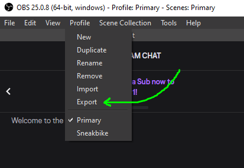
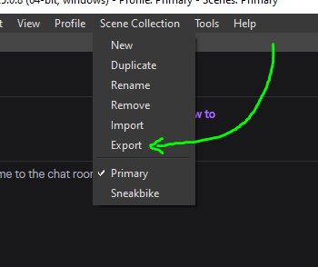
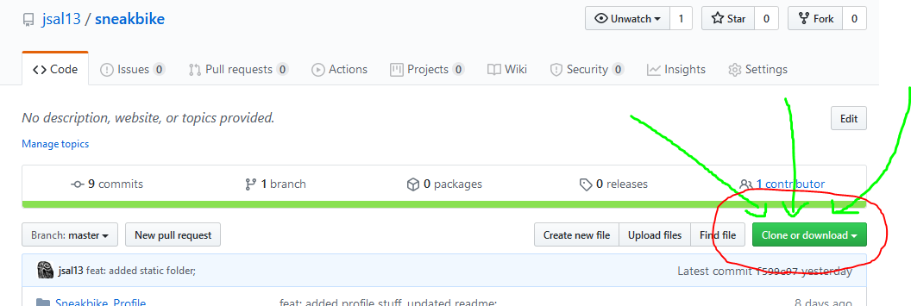
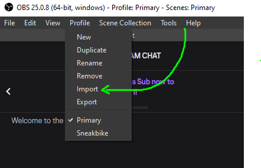
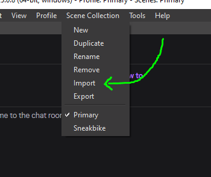

# Runner Setup

This guide should take you through everything you need to do to be a Sneakbike Runner!

- [Runner Setup](#runner-setup)
  - [Step 0: Backing Everything Up For Safety](#step-0--backing-everything-up-for-safety)
  - [Step 1: Necessary Software](#step-1--necessary-software)
  - [Step 2: Download this Repository](#step-2--download-this-repository)
  - [Step 3. Import things into OBS](#step-3-import-things-into-obs)
    - [Importing a Profile](#importing-a-profile)
    - [Importing Scenes](#importing-scenes)
  - [Step 4. The Final Touches](#step-4-the-final-touches)

---

---

## Step 0: Backing Everything Up For Safety

_If you're dowloading OBS for the first time, you can skip this section._

If you've already been using OBS, it's better to be safe than sorry. We'll back up your major things:

1. Go to `Profile > Export`. Save your profile in a safe place. It wants you to pick a folder, just pick whatever you want and it'll make its own folder inside of it.

   

   - You can re-import your profile if something goes wrong.
   - Don't worry, this hasn't happened to me yet.

2. Go to `Scene Collection > Export`. Save your scene collection in a safe place.

   

   - You can re-import your scenes if something goes wrong.
   - Don't worry, this hasn't happened to me yet either.

---

---

## Step 1: Necessary Software

For a consistent experience, we use the following:

1. A recent version of `Retroarch` (currently v1.8.8)

   - [Windows Download](http://buildbot.libretro.com/stable/1.8.8/windows/x86_64/RetroArch-x64-setup.exe)
   - **TODO: Mac**
   - **TODO: Linux**

2. The following `Retroarch cores` by opening Retroarch and clicking `Load Core > Download Core` and picking the following:

   - Nintendo - Game Boy / Color (Gambatte)
   - Nintendo - Game Boy Advance (mGBA)
   - Nintendo - NES / Famicom (Mesen)
   - Nintendo - SNES / SFC (Snes9x)
   - Sega MS/GG/MD/CD (Genesis Plus GX)

3. Fairly recent version of `OBS` (currently 25.0.8)
   - [Windows Download](https://cdn-fastly.obsproject.com/downloads/OBS-Studio-25.0.8-Full-Installer-x64.exe)
   - **TODO: Mac**
   - **TODO: Linux**

---

---

## Step 2: Download this Repository

1. Go to "Clone or Download" on this webpage and download the zip file of this repository.
2. Unzip it when it's done downloading.

   

---

---

## Step 3. Import things into OBS

There are two things we need to import, Scenes and a Profile.

### Importing a Profile

1. In OBS, go to `Profile > Import`, click the `Sneakbike_Profile` folder from the unzipped repository.

   

2. If you click `Profile` again, you should see (probably) two profiles at the bottom: `Untitled` and `Sneakbike`. `Untitled` is your default. You can switch back to `Untitled` to go back to your normal streaming profile.

### Importing Scenes

1. In OBS, go to `Scene Collection > Import`, click the `...` button and find the `snakebike_scenes.json` file in the unzipped folder.

   

2. Click `Import`.
3. If you go into `Scene Collection` again, you should see (probably) two scenes at the bottom: `Untitled` and `Sneakbike`. `Untitled` is your default scenes. You can switch back to `Untitled` to get back to your default scenes.
   - Try switching between the two and you'll get the gist of what's happening.

**We'll be using the `Sneakbike` profile with the `Sneakbike` scenes for these races.**

---

---

## Step 4. The Final Touches

0. Before beginning the races, please try out some games from NES, SNES, Genesis to make sure your controller is correctly configured.
   - Most Genesis games do not require the full Genesis controller and we will try to avoid the ones which do.
   - We will give a list of games to try out in the `#Sneakbike` channel.

---

---

That's all! Check out the [runner_resources](./runner_resources.md) doc to see what we'll be telling you to do on race day!
